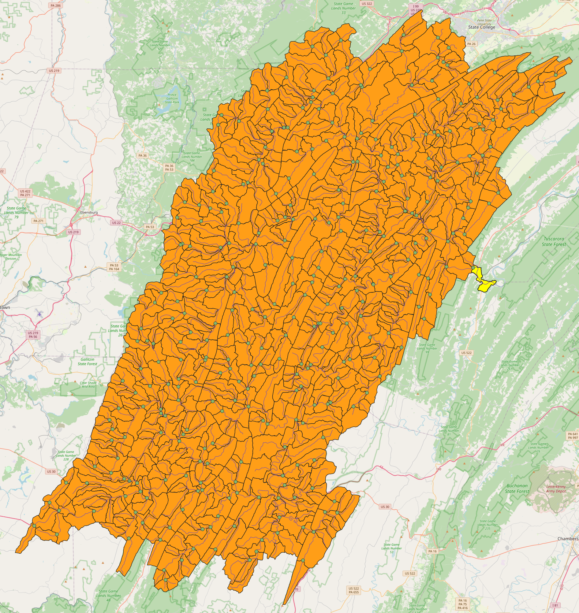

# ddr
Distributed Differentiable Routing

## Domain of interest: 
The Juniata River Basin

## NextGen
DDR supports the NextGen framework through its BMI (`scripts/bmi.py`) and a collection BMI configuration files and NextGen realizations contained in `ngen_resources/data/`. See the README in this directory for further details about setup.
