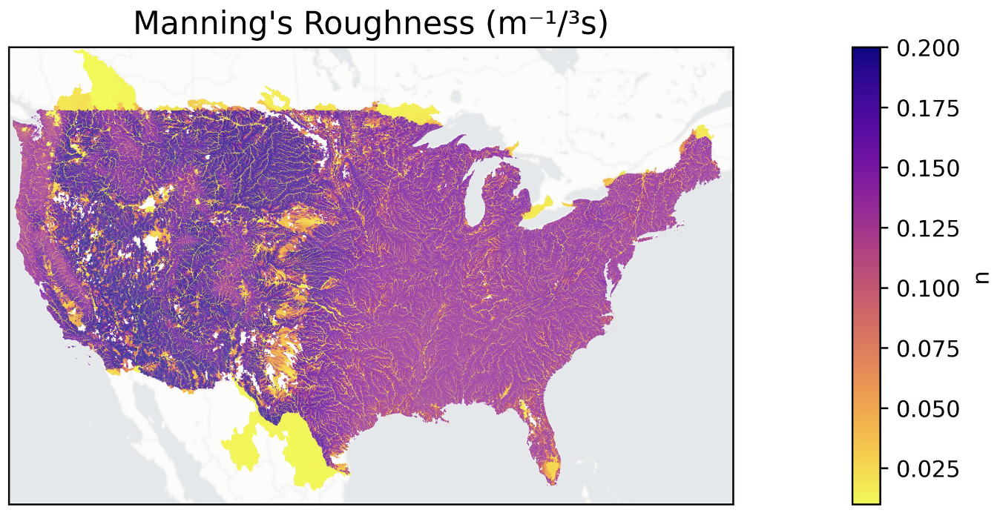

# Examples

DDR ships with pre-trained weights and example notebooks for both supported geodatasets.

## Directory Structure

```
examples/
├── merit/                      # MERIT-Hydro examples
│   ├── example_config.yaml     # Config pointing to v0.5.2 trained weights
│   ├── ddr-v0.5.2_merit_trained_weights.pt
│   └── plot_parameter_map.ipynb
├── lynker_hydrofabric/         # Lynker Hydrofabric v2.2 examples
│   ├── example_config.yaml     # Config pointing to v0.5.2 trained weights
│   ├── ddr-v0.5.2.lynker_hydrofabric_trained_weights.pt
│   └── plot_parameter_map.ipynb
├── eval/                       # Evaluation notebook (dataset-agnostic)
│   └── evaluate.ipynb
└── parameter_maps/             # Legacy v0.1.0a2 example (Lynker only)
    └── plot_parameter_map.ipynb
```

## Parameter Map Notebooks

These notebooks visualize the spatial distribution of learned routing parameters (Manning's roughness, channel geometry) across CONUS.

<p align="center">
  
</p>

### Setup

1. Set `DDR_DATA_DIR` to your local data directory, or edit the `example_config.yaml` paths directly
2. Open the notebook for your dataset (`examples/merit/` or `examples/lynker_hydrofabric/`)
3. Run all cells

Each `example_config.yaml` uses `${oc.env:DDR_DATA_DIR,./../../data}` so paths resolve relative to the repo root's `data/` folder by default.

### What the Notebooks Show

1. **Load config and trained weights** — The v0.5.2 checkpoints use a 10-attribute KAN with `hidden_size=21`, `grid=50`, `k=2`
2. **Predict spatial parameters** — Run the KAN in eval mode to produce per-catchment parameter predictions
3. **Map parameters** — Plot Manning's *n*, *q_spatial*, and other learned parameters on the CONUS river network using GeoPandas and contextily basemaps

### MERIT vs Lynker Differences

| Aspect | MERIT | Lynker Hydrofabric |
|--------|-------|--------------------|
| Geodataset enum | `merit` | `lynker_hydrofabric` |
| ID column | `COMID` (integer) | `divide_id` (string, `cat-*` prefix) |
| Geometry file | `.shp` | `.gpkg` (layer: `divides`) |
| Upstream area attribute | `log10_uparea` | `log_uparea` |

## Model Evaluation

The `examples/eval/evaluate.ipynb` notebook demonstrates how to compare routed predictions against observations and the summed Q' baseline.
